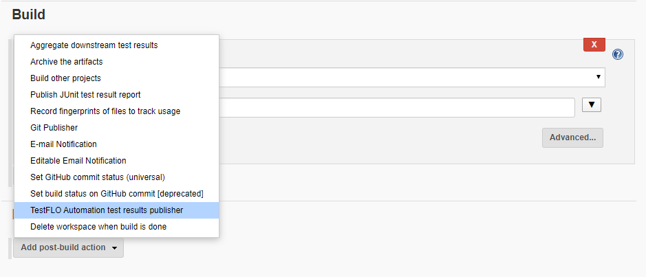
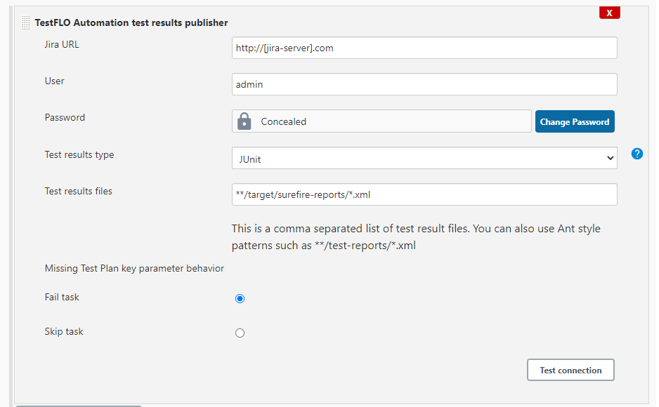
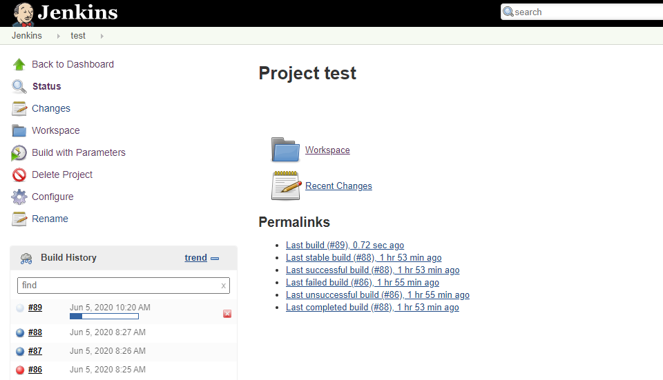

### About the plugin

This plugin integrates Jenkins with [TestFLO](https://marketplace.atlassian.com/apps/1211393/testflo-test-management-for-jira?hosting=datacenter&tab=overview)
for Jira app, allowing to publish build test results and import them as Test Cases in Jira.

### Requirements

- Jenkins 2.249 or higher
- Jira instance (server / data center) with installed TestFLO app

### Supported test results formats

- JUnit
- TestNG
- Cucumber (only in json output format)

### Compatibility with TestFLO app

|Jenkins plugin version|TestFLO app version|
|------|------|
|1.1.0|8.9.0 and higher|
|1.0.5|8.0.0 to 8.8.1|

### Usage

This plugin provides new build task, which should be used in Post-build actions in the configuration of a jenkins job:  


The following fields are present:  


- Jira URL - URL to Jira instance, which receives test results
- User - Jira user login
- Password - Jira user password
- Test results type - Framework used to produce result files. Cucumber supports only json results format
- Test results files - Paths of test results files
- Missing Test Plan key parameter behaviour - when task doesn't get Jira Test Plan issue key, it can either skip this task or fail it

To verify task configuration, you can use "Test connection" button:  


To make job possible to trigger from the TestFLO app, it is required to parametrize a job with 3 parameters:  


- testPlanKey - contains issue key of Test Plan from which job is being run
- targetIteration - tells whether to add Test Cases to current iteration in test plan, or to create new. You can provide default value using these options:
    - CURRENT_ITERATION
    - NEW_ITERATION
- testCaseCreationStrategy - tells whether new Test Cases should be created with test results, or only limited to updating existing Test Cases. You can define
  default value, using these options:
    - CREATE_AND_UPDATE
    - UPDATE_EXISTING

#### Running tests from Jira

Most common usage is to run tests from Jira, using the TestFLO app.  


Clicking on the run button triggers execution of selected job in Jenkins.  


After Job completes, test results are sent back to Jira, which become Test Case issues on original Test Plan.  


#### Running tests directly from Jenkins manually

Another possible way to run tests is to trigger a job execution manually, providing required parameters, which normally are handled automatically, using first
approach.  


In this case, the job completed successfully fixing previous failed tests, displaying them in a next Test Plan iteration.  


#### Running tests directly from Jenkins as a part of CI process

It is also possible to use automatic job execution, e.g. after changes in code repository are pushed. This however requires specifying default parameters in
plugin configuration.  


Another option is to use environment variables instead of job parameters. That way, a job can be parameterless, which could be more useful for scripting
purposes. Example below uses Jenkins pipeline syntax, providing required parameters inside the "environment" directive.

Variable "testResultsType" accepts the following values:

- JUNIT
- TESTNG
- CUCUMBER

Variable "missingTestPlanKeyStrategy" accepts the following values:

- FAIL_TASK
- SKIP_TASK

```groovy
pipeline {
    agent any
    environment {
        testPlanKey = 'DDD-804'
        testCaseCreationStrategy = 'CREATE_AND_UPDATE'
        targetIteration = 'CURRENT_ITERATION'
    }
    post {
        always {
            step([
                    $class                    : 'TestResultSenderBuildStep',
                    jiraURL                   : 'http://localhost:5000/jira',
                    jiraUserName              : 'admin',
                    jiraPassword              : hudson.util.Secret.fromString(SECRET),
                    testResultsDirectory      : '**/target/surefire-reports/*.xml',
                    testResultsType           : 'JUNIT',
                    missingTestPlanKeyStrategy: 'FAIL_TASK'
            ])
        }
    }
}
```