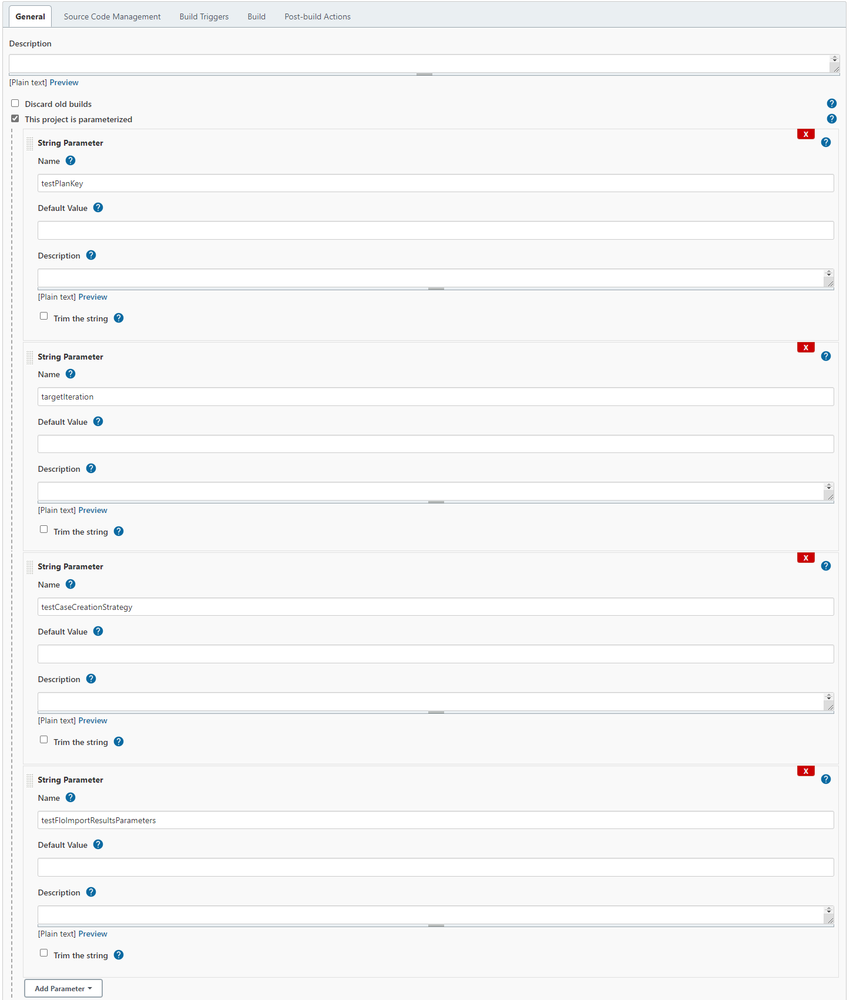

### About the plugin
This plugin integrates Jenkins with [TestFLO](https://marketplace.atlassian.com/apps/1211393/testflo-test-management-for-jira?hosting=datacenter&tab=overview) for Jira app, allowing to publish build test results and import them as Test Cases in Jira.

### Requirements
- Jenkins 2.138.4 or higher
- Jira instance (server / data center) with installed TestFLO app  

### Supported test results formats
- JUnit
- TestNG

### Usage
This plugin provides new build task, which should be used in Post-build actions in the configuration of jenkins job:  

Following fields are present:  

- Jira URL - URL to Jira instance, which receives test results
- User - Jira user login
- Password - Jira user password
- Test results directory - Directories from which task gets test results files
- Missing Test Plan key parameter behaviour - when task doesn't get Jira Test Plan issue key, it can either skip this task or fail it

To verify task configuration, you can use "Test connection" button:  

To make job possible to trigger from TestFLO app, it is required to parametrize job with 3 parameters:  

- testPlanKey - contains issue key of Test Plan from which job is being run
- targetIteration - tells whether to add Test Cases to current iteration in test plan, or to create new. You can provide default value using these options: 
    - CURRENT_ITERATION
    - NEW_ITERATION
- testCaseCreationStrategy - tells whether new Test Cases should be created with test results, or only limited to updating existing Test Cases. 
You can define default value, using these options: 
    - CREATE_AND_UPDATE
    - UPDATE_EXISTING

#### Running tests from Jira
Most common usage is to run tests from Jira, using TestFLO app.  

Clicking on run button triggers execution of selected job in Jenkins.  

After Job completes, test results are sent back to Jira, which become Test Case issues on original Test Plan.  
 

#### Running tests directly from Jenkins manually
Another possible way to run tests is to trigger job execution manually, providing required parameters, which normally are handled automatically, using first approach.  

In this case, job completed successfully fixing previous failed tests, displaying them in next Test Plan iteration.  

#### Running tests directly from Jenkins as a part of CI process
It is also possible to use automatic job execution, e.g. after changes in code repository are pushed. This however requires specifying default parameters in plugin configuration.  
